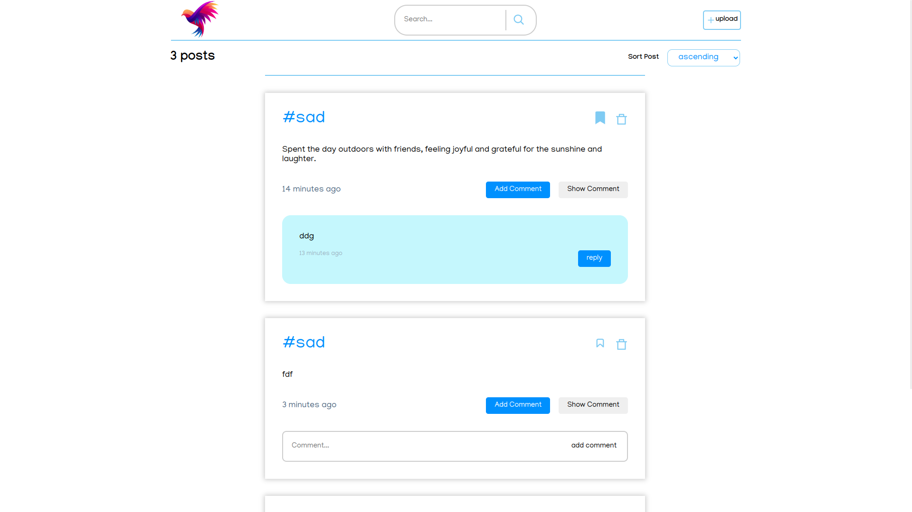
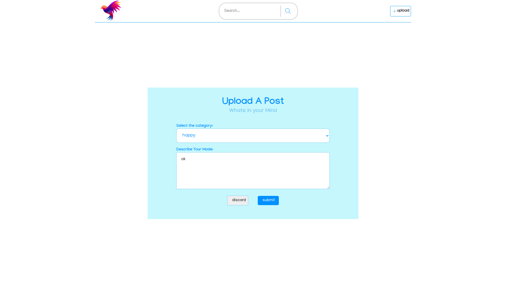

<h1 align="center">
  
</h1>

Table of Contents

- [About](#about)
  - [Motive](#Motive)
- [Project Repositories](#folder-structure)
  - [Frontend](#frontend)
  - [Backend](#backend)
- [Tech Stack](#tech-stack)
- [tools](#tools)
- [view](#view)

---

## About

<table>
<tr>
<td>

Full Stack MERN website

feature:

- Creating a Post
- Comment on a post
- Sort post in ascending or descending order
- Bookmark a post
- Delte a post
 

</td>
</tr>
</table>

### 📁 Assignment Repository: 
- <a href="https://github.com/Lobi29/assignmentIntern">🖥️ Frontend<a/>
- <a href="https://github.com/Lobi29/testBackend">🖥️ Backend<a/>

### 💻 Tech Stack:

&nbsp;
&nbsp;
&nbsp;

&nbsp;
&nbsp;
&nbsp;

### 🛠 Tools:

&nbsp;
&nbsp;
&nbsp;

### View:
<h1 align="center">
  
</h1>
<h1 align="center">
  
</h1>
